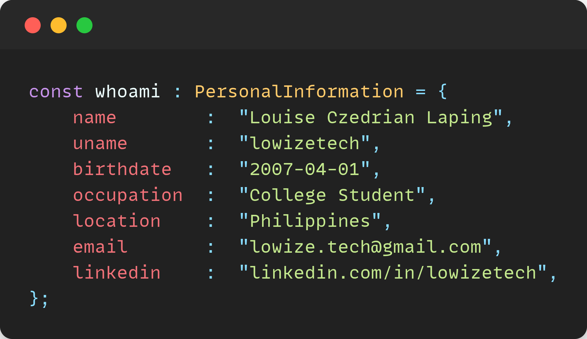

# “ PROBLEMA EADEM RATIONE SOLVI NON POTEST ”

### **`Strategic | Motivated | Adaptive | Researcher | Technical`**

  

 

Hello, World! I’m Louise Czedrian, but whatever, just call me Lowiz or Zed. I approach development with curiosity and purpose, focusing on creating practical and reliable solutions. I enjoy learning new technologies, refining my skills, and applying logical thinking to solve problems. My work reflects a steady approach to improvement, combining clarity, efficiency, and thoughtful design to build projects that make sense and serve a purpose.

 

  

  

### **`Languages | Libraries | Frameworks | Tools`**
 

  

  
